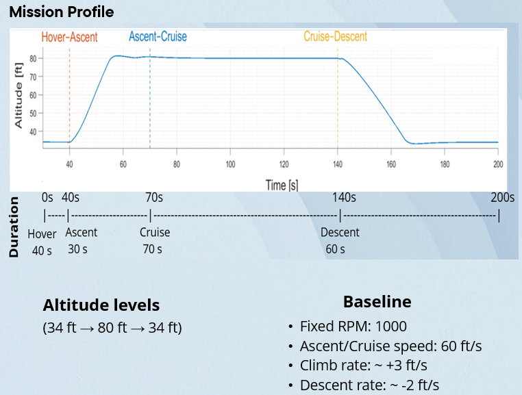
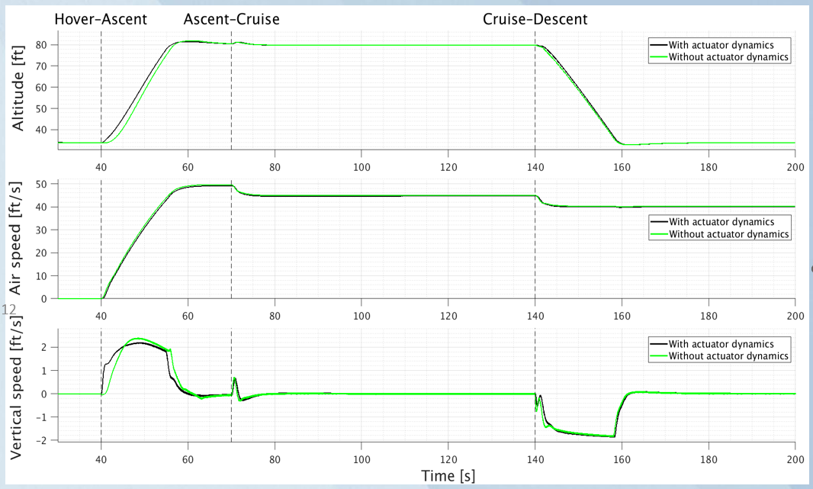
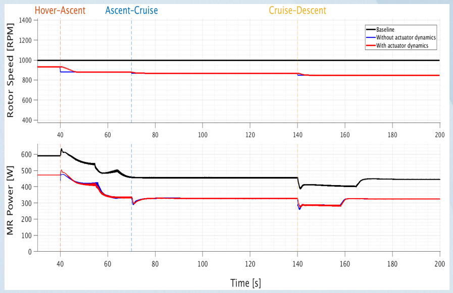
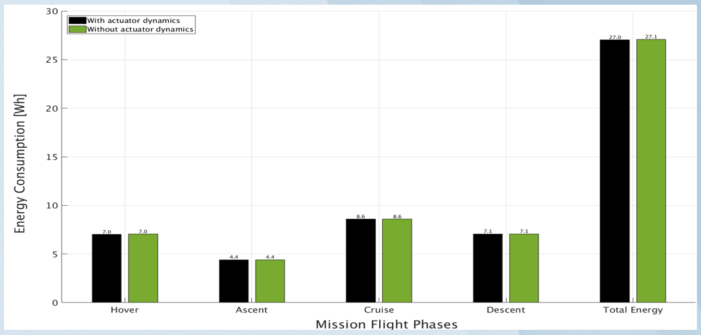

# Assessing the Impact of Actuator and Rotor Dynamics on Energy-Optimal Electric Rotorcraft Missions

> **Investigation of how actuator rate limits and rotor dynamic response affect energy-optimal mission performance in electric unmanned helicopters.**

**Authors:** Emeka Chijioke · Hussien Ahmedelbadawi · Marcin Żugaj  
**Affiliation:** Warsaw University of Technology, Faculty of Power and Aeronautical Engineering  
**Conference:** READ 2026

---

## 🎤 Conference Presentation

## READ 2026

**Assessing the Impact of Actuator and Rotor Dynamics on Energy-Optimal Electric Rotorcraft Missions**

The complete **21-minute conference presentation**, including the questions and discussion session, is available on YouTube.

**▶️ [Watch the full conference presentation](https://youtu.be/wpQ-Fbfl3mo)**

---

## Overview

Electric rotorcraft are inherently constrained by limited onboard energy, making propulsion efficiency a central factor in mission endurance. Variable rotor speed operation and trajectory optimization can significantly reduce mission energy consumption, but many optimization studies rely on idealized assumptions in which control commands can be followed instantaneously.

In practical propulsion systems, actuator bandwidth, mechanical inertia, and rotor response dynamics constrain how quickly commanded operating points can be achieved.

This study investigates whether these dynamic limitations materially affect the performance of missions optimized for minimum energy consumption.

Using a combined **MATLAB/Simulink and FLIGHTLAB simulation framework**, optimized mission profiles are evaluated under two configurations:

| Configuration | Description |
|---|---|
| **Ideal model** | No actuator rate limits or dynamic filtering |
| **Constrained model** | Actuator rate limits and rotor dynamic response enabled |

The objective is to quantify the influence of these dynamics on:

- Trajectory tracking
- Rotor behavior
- Power demand
- Cumulative mission energy consumption
- Physical feasibility of optimized control strategies

---

## Research Question

> **How significantly do actuator rate limits and rotor dynamic response affect the performance and energy consumption of an energy-optimized electric rotorcraft mission?**

The study specifically examines whether energy-optimal strategies derived using idealized control assumptions remain physically feasible when realistic dynamic constraints are introduced.

---

## Objectives

- Compare optimized mission performance under idealized and dynamically constrained actuation.
- Quantify the effect of actuator and rotor dynamics on total mission energy.
- Evaluate changes in altitude, airspeed, and vertical-speed tracking.
- Examine the influence of dynamic constraints on rotor speed response and power demand.
- Assess whether simplified actuator models are adequate for preliminary mission-level energy assessment.
- Identify situations where higher-fidelity dynamic modeling becomes important.

---

# Simulation Framework

The simulation environment combines **MATLAB/Simulink supervisory control** with **FLIGHTLAB's nonlinear six-degree-of-freedom (6DoF) rotorcraft model**.

The framework captures:

- Nonlinear rigid-body dynamics
- Rotor aerodynamic behavior
- Closed-loop control
- Mission-phase transitions
- Rotor speed scheduling
- Propulsion power demand
- Electrical energy consumption

### Simulation Framework & Mission Profile

*Overview of the simulation environment and investigated hover–ascent–cruise–descent mission.*

---

## Mission Profile

The investigated mission consists of four flight phases:

| Phase | Duration |
|---|---:|
| Hover | 40 s |
| Ascent | 30 s |
| Cruise | 70 s |
| Descent | 60 s |
| **Total** | **200 s** |

The mission begins at approximately **34 ft**, climbs to a maximum altitude of **80 ft**, and returns to the initial altitude.

The relatively long cruise phase makes it a dominant contributor to total mission energy consumption.

---

# Actuator & Rotor Dynamic Modeling

Two configurations are evaluated:

### Ideal Model

The ideal model assumes that commanded variables can be followed instantaneously, with no rate limitations or dynamic filtering.

### Constrained Model

The constrained model introduces physically motivated dynamic limitations.

### Dynamic Constraints

| Parameter | Constraint | Purpose |
|---|---:|---|
| Rotor speed rate | **\|dΩ/dt\| ≤ 10 RPM/s** | Limits rotor speed transition rate |
| Airspeed rate | **\|dV/dt\| ≤ 12 ft/s²** | Smooths airspeed transitions |
| Altitude rate | **\|dh/dt\| ≤ 5 ft/s** | Smooths altitude transitions |
| Rotor response | **First-order model** | Represents rotor dynamic lag |

These constraints smooth commanded transitions and reduce unrealistic instantaneous changes in rotor speed, airspeed, and altitude.

# Energy Model

Electrical power demand is estimated using a **propulsion-system efficiency-map-based model**.

The main rotor operating condition is characterized by:

- Rotor rotational speed
- Rotor shaft torque

These quantities are used as inputs to a **2D lookup table implemented in MATLAB/Simulink**, which provides the corresponding electrical power requirement.

### Mission Energy

Total mission energy is obtained by integrating electrical power over the mission duration:

**Eₘᵢₛₛᵢₒₙ = (1/3600) ∫₀ᵗᵐⁱˢˢⁱᵒⁿ Pₑ(t) dt**

where:

- **Pₑ(t)** = electrical power [W]
- **t** = time [s]
- **Eₘᵢₛₛᵢₒₙ** = total electrical energy [Wh]

---

# Optimization Approach

A **phase-based parametric search** is used to identify energy-efficient rotor speed and trajectory configurations.

The optimization considers phase-dependent parameters including:

- Rotor speed
- Airspeed
- Altitude
- Climb rate
- Descent rate

The optimized schedules obtained under ideal assumptions are then evaluated using both the ideal and constrained dynamic models.

> **Why this comparison matters:**  
> The optimized commands are not re-optimized after introducing the dynamic constraints. This isolates the effect of actuator and rotor dynamics rather than allowing re-optimization to compensate for the introduced constraints.

---

# Results

## 1. Flight-Profile Tracking

The ideal and constrained models both successfully follow the overall **hover–ascent–cruise–descent** mission profile.

The constrained model introduces small delays during phase transitions, particularly around the onset of ascent and descent. These effects are more visible in vertical-speed behavior, where transient deviations and small oscillations appear.

However, the steady-state portions of the mission remain closely matched.

### Flight-Profile Comparison

**Key observation:** actuator and rotor dynamics primarily influence short duration transients rather than steadystate flight behavior.

---

## 2. Rotor Response & Power Demand

The dynamic model suppresses abrupt rotor speed changes and smooths transient power behavior.

Compared with the ideal model:

- Rotor speed transitions become smoother.
- Short duration power deviations are introduced.
- Steady state hover and cruise power remain largely unchanged.

### Rotor Speed & Power Response

This demonstrates the distinction between an **energy-optimal command** and a **physically realizable response**.

---

## 3. Mission Energy

For the investigated mission profile, the introduction of actuator and rotor dynamics has a minimal effect on cumulative energy consumption.

The energy difference remains below **0.5%** across the compared cases, while phase-level differences remain below **0.1 Wh**.

The cruise phase contributes the largest portion of total mission energy consumption, making it the dominant driver of mission efficiency.

### Energy Comparison

> **Key result:** 

- For the investigated mission, actuator and rotor dynamics have a substantially larger influence on transient response and trajectory tracking than on total mission energy.

- Mission optimization achieves approximately **25% energy savings relative to the baseline**, while introducing actuator and rotor dynamics changes total mission energy by less than **0.5%** for the investigated mission profile.
---

# Key Findings

| Finding | Result |
|---|---|
| **Energy optimization** | ~25% energy savings relative to baseline |
| **Trajectory impact** | Small transient deviations during phase transitions |
| **Rotor response** | Smoother transitions with dynamic constraints |
| **Phase energy difference** | < 0.1 Wh |
| **Total mission energy difference** | < 0.5% |
| **Primary effect of dynamics** | Transient behavior and physical feasibility |

### Engineering Takeaway

> **Actuator and rotor dynamics primarily affect how the optimized mission is executed, rather than substantially changing its total energy requirement for the investigated mission profile.**

---

# Engineering Interpretation

For the mission profile investigated, neglecting actuator and rotor dynamics introduces only a small error in total energy prediction.

This suggests that **simplified actuator representations can be appropriate for preliminary mission-level energy assessment** when the mission consists primarily of smooth flight phases.

However, dynamic constraints remain important for:

- Physical realizability
- Trajectory tracking
- Control feasibility
- Transient response
- Stability analysis
- Aggressive maneuvering

Therefore:

> **Energy optimization and dynamic feasibility should be viewed as complementary stages rather than interchangeable modeling approaches.**

An energy-optimal solution is not necessarily a physically realizable control command.

---

# Novelty & Contribution

The work complements existing research on rotor speed scheduling and trajectory optimization by explicitly examining the practical implementation constraints associated with actuator and rotor dynamics.

### Main Contributions

1. **Quantification of the energetic impact** of actuator and rotor dynamic constraints.
2. **Comparison of idealized and dynamically constrained mission execution.**
3. **Demonstration that cumulative mission energy can be relatively insensitive to these dynamics** for smooth mission profiles.
4. **Identification of the distinction between energy prediction and physical feasibility.**
5. **Establishment of conditions under which simplified models may be sufficient** for preliminary mission-level analysis.

> **Core contribution:** The study shows that realistic actuator and rotor dynamics can materially change transient mission behavior without necessarily producing a significant change in cumulative mission energy.

---

# Aircraft / UAV Configuration

The simulations use an **autonomous reconfigurable compound helicopter** developed at the Warsaw University of Technology for education and research.

| Parameter | Value |
|---|---:|
| Mass | 7.3 kg |
| Main rotor diameter | 1.78 m |
| Tail rotor diameter | 0.158 m |
| Baseline rotor speed | 1000 RPM |
| Rotor speed optimization range | 850–1000 RPM |

---

# Tools & Technologies

| Category | Technology | Application in this Project |
|---|---|---|
| **Simulation** | MATLAB / Simulink | Mission scheduling, supervisory control, energy modeling, data processing, and results analysis |
| **Rotorcraft Modeling** | FLIGHTLAB | High-fidelity modeling and simulation of the electric rotorcraft flight dynamics |
| **Dynamics** | Nonlinear 6DoF rotorcraft simulation | Simulation of rigid-body motion and dynamic response throughout the mission |
| **Propulsion** | Electric propulsion modeling | Estimation of propulsion-system performance and electrical power demand |
| **Control** | Actuator rate limiting | Representation of realistic rotor speed, airspeed, and altitude transition constraints |
| **Optimization** | Mission-level parametric optimization | Identification and evaluation of energy-efficient rotor speed and flight-path configurations |
| **Aerodynamics** | Rotor aerodynamic modeling | Representation of rotor aerodynamic loads and power requirements across different flight phases |
| **Energy** | Propulsion efficiency-map modeling | Mapping rotor speed and shaft torque to electrical power demand for mission-energy estimation |

### Engineering Competencies Demonstrated

- Rotorcraft flight dynamics
- Mission-level energy optimization
- Electric propulsion modeling
- Actuator and rotor dynamics
- Dynamic constraint implementation
- Trajectory and flight-path analysis
- Simulation-based engineering analysis
- Technical interpretation of simulation results

---

# Future Work

Future research will investigate more demanding flight conditions to determine when actuator and rotor dynamics have a stronger influence on energy-optimal mission execution.

Key areas include:

- Aggressive rotorcraft maneuvers
- Rapid flight-phase transitions
- Larger changes in rotor speed
- Missions with greater transient activity

These scenarios may reveal stronger interactions between dynamic feasibility, trajectory tracking, and energy-optimal control.

---

# Accepted Conference Abstract

**Title:** *Assessing the Impact of Actuator and Rotor Dynamics on Energy-Optimal Electric Rotorcraft Missions*

**Authors:** Emeka Chijioke, Hussien Ahmedelbadawi, Marcin Żugaj

**Affiliation:** Warsaw University of Technology, Faculty of Power and Aeronautical Engineering

**Conference:** READ 2026

**Status:** Abstract accepted for conference presentation

**Keywords:** Electric rotorcraft · Actuator dynamics · Rotor response modeling · Energy optimization · Mission-level performance

---

# Disclaimer

This repository documents the research methodology, simulation approach, and findings presented at READ 2026.

Availability of source code, simulation models, experimental data, and other research materials is subject to applicable university, laboratory, software-license, and collaboration restrictions.

---

## Project Summary

**Research area:** Electric Rotorcraft · UAVs · Mission Optimization · Flight Dynamics  
**Primary tools:** MATLAB · Simulink · FLIGHTLAB  
**Focus:** Energy Optimization · Actuator Dynamics · Rotor Dynamics · Mission-Level Performance  
**Conference:** READ 2026